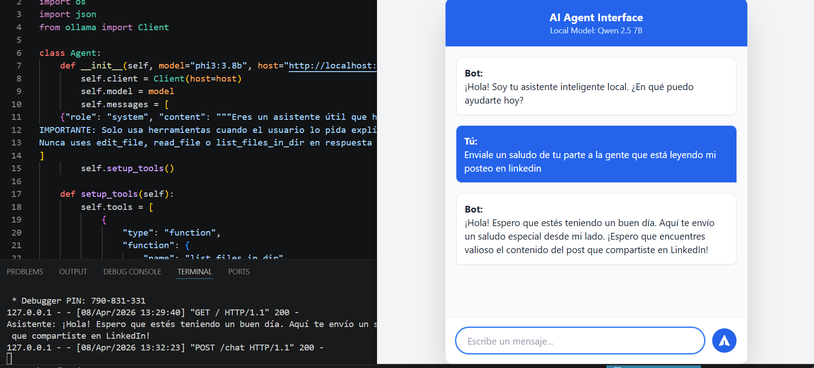

# 🤖 Local AI Agent Interface

Este proyecto es un **Agente de Inteligencia Artificial** funcional con una interfaz web moderna. Utiliza un modelo de lenguaje local (LLM) para procesar consultas y tiene la capacidad de interactuar con el sistema de archivos local mediante *Function Calling*.

Desarrollado como parte de mi camino hacia el rol de **AI Engineer**, aplicando conceptos aprendidos en mi certificación **AWS AI Practitioner**.

---

## 🚀 Características Clave

- **Motor de IA Local:** Ejecución de modelos como `Qwen 2.5 7B` o `Phi-3` a través de **Ollama**.
- **Capacidades Agénticas:** El agente puede ejecutar herramientas (*tools*) como listar archivos de directorios y leer contenido de archivos basados en lenguaje natural.
- **Interfaz Web Moderna:** Chat UI responsivo construido con **Flask** y **Tailwind CSS**.
- **Arquitectura Modular:** Separación clara entre la lógica del agente (`agent.py`) y el servidor web (`server.py`).

---

## 🛠️ Stack Tecnológico

- **Lenguaje:** Python 3.x
- **Backend:** Flask
- **IA:** Ollama (Local LLM)
- **Frontend:** HTML5, Tailwind CSS (vía CDN), JavaScript (Fetch API)
- **Gestión de Variables:** Python-dotenv

---

## 📋 Requisitos Previos

1. **Ollama instalado:** [Descargar Ollama](https://ollama.com/) y tener el modelo deseado descargado  
   Ejemplo:
   ```bash
   ollama pull qwen2.5:7b
   ```

2. **Python 3.10+** instalado.

---

## 🔧 Instalación y Configuración

### 1. Clonar el repositorio

```bash
git clone https://github.com/tu-usuario/tu-repo.git
cd tu-repo
```

### 2. Crear y activar entorno virtual

```bash
python -m venv env
```

**En Windows:**
```bash
.\env\Scripts\activate
```

**En Linux / Mac:**
```bash
source env/bin/activate
```

### 3. Instalar dependencias

```bash
pip install -r requirements.txt
```

### 4. Configurar variables de entorno

Crea un archivo `.env` en la raíz del proyecto y añade tus configuraciones (si usas APIs externas en el futuro).

---

## 🏃 Cómo Ejecutar

### En Windows (Rápido)

Simplemente haz doble clic en el archivo:

```bash
run_chat.bat
```

### Manualmente (Cualquier SO)

Asegúrate de que **Ollama esté corriendo** y luego ejecuta:

```bash
python chatbot_interface/server.py
```

Luego abre tu navegador en:

```text
http://127.0.0.1:5000
```

---

## 📂 Estructura del Proyecto

```text
project-root/
│
├── agent.py
├── server.py
├── requirements.txt
├── .gitignore
├── .env
│
└── chatbot_interface/
    └── templates/
        └── index.html
```

### Descripción

- `agent.py` → Definición de la clase del agente y sus herramientas (*tools*).
- `server.py` → Servidor Flask que gestiona las peticiones HTTP y la orquestación.
- `chatbot_interface/templates/index.html` → Interfaz de usuario del chat.
- `requirements.txt` → Dependencias del proyecto.
- `.gitignore` → Archivos excluidos del repositorio (`env`, `__pycache__`, etc.).

---

## 📈 Próximos Pasos (Roadmap)

- [ ] Migración a la nube usando Google Gemini API
- [ ] Despliegue en vivo en Vercel / Render
- [ ] Implementación de memoria persistente para historial de chat
- [ ] Integración con base de datos vectorial para RAG
- [ ] Logging y monitoreo del agente

---

## 📸 Demo

Si podés, agregá una captura de pantalla del chat:

```markdown
![Demo del Chat]

```

Eso hace que el repositorio se vea mucho más profesional.

---

## 🤝 Contacto

Hecho con ❤️ por **[Christian]**

[Conectemos en LinkedIn](https://www.linkedin.com/in/christianzamorahermida/)